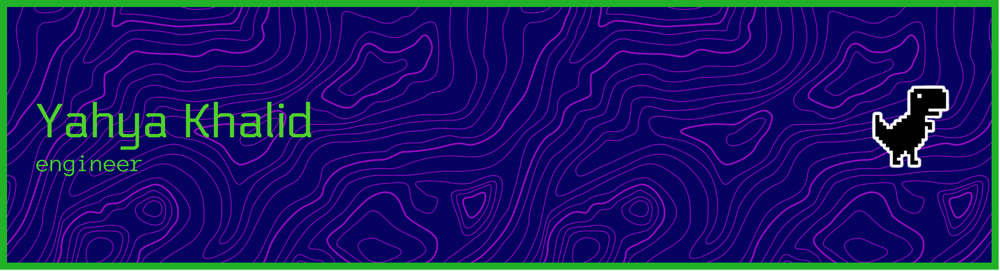

---
### `⬥ 𝙴𝚍𝚞𝚌𝚊𝚝𝚒𝚘𝚗`
 

### `⬥ 𝙸𝚗𝚝𝚎𝚛𝚎𝚜𝚝𝚜`

### `⬥ 𝙰𝚛𝚎𝚊𝚜`

### `⬥ 𝚂𝚔𝚒𝚕𝚕𝚜`

|     |         |
|--------|--------------|
| **.𝚕𝚊𝚗𝚐𝚞𝚊𝚐𝚎s** |     |
| **.𝚏𝚛𝚊𝚖𝚎𝚠𝚘𝚛𝚔s** |               |
| **.𝚝𝚘𝚘𝚕𝚜** |      |
| **.𝚍𝚘𝚌𝚞𝚖𝚎𝚗𝚝ation** |     |
| **.𝚑𝚊𝚛𝚍𝚠𝚊𝚛𝚎** |      |
| **.𝚘𝚜** |   

### `⬥ 𝙶𝚒𝚝𝚑𝚞𝚋`

<!--

-->

<!--  -->
<!--
### Programming Languages

### Tools Frameworks

### Currently Exploring

### Hardware Knowledge

### Operating Systems 

-->

<!-- ✦ ✶ ▸ ⬥ -->
